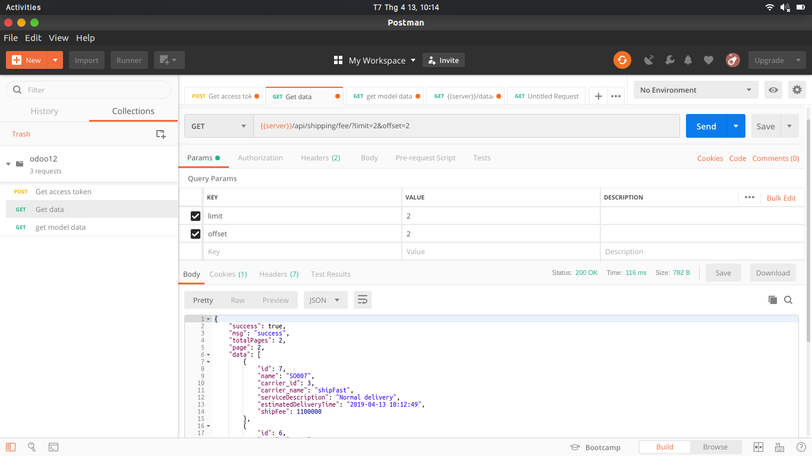

Get api Tính phí vận chuyển cho một đơn hàng.

Mô tả :Tính năng này dùng để tính phí vận chuyển cho một đơn hàng. Mỗi khi khách hàng vào trang Giỏ hàng, hoặc ở bước thanh toán, website của bạn có thể call API này để tính phí vận chuyển cho đơn hàng và hiển thị chi tiết tổng tiền của đơn hàng bao gồm cả phí vận chuyển và phí thu tiền hộ (nếu khách hàng chọn hình thức thanh toán khi nhận hàng).

**Response: 

[
"name": "SO007",  //tên

"carrier_id": 3,  //id hãng vận chuyển

"carrier_name": "shipFast",  //tên hãng vận chuyển

"serviceDescription": "Normal delivery",  //miêu tả vận chuyển

"estimatedDeliveryTime": "2019-04-05 01:44:16",  //thời gian dự tính

"shipFee": 1100000  // giá vận chuyển
]

**Hướng dẫn: 

- Sử dụng postman để lấy dữ liệu từ api: /api/shipping/fee/ lấy toàn bộ phí cho tất cả đơn hàng.
- /api/shipping/fee/+ tên thành phố kho hàng : lấy chi phí vận chuyển của kho hàng theo tên thành phố kho hàng.
- /api/shipping/fee/+ tên thành phố nhận hàng : lấy chi phí vận chuyển của người nhận theo tên thành phố người nhận.
- Có thể lấy theo số lượng muốn lấy bằng cách thêm phần limit và offset vào phần Pagram của postman

